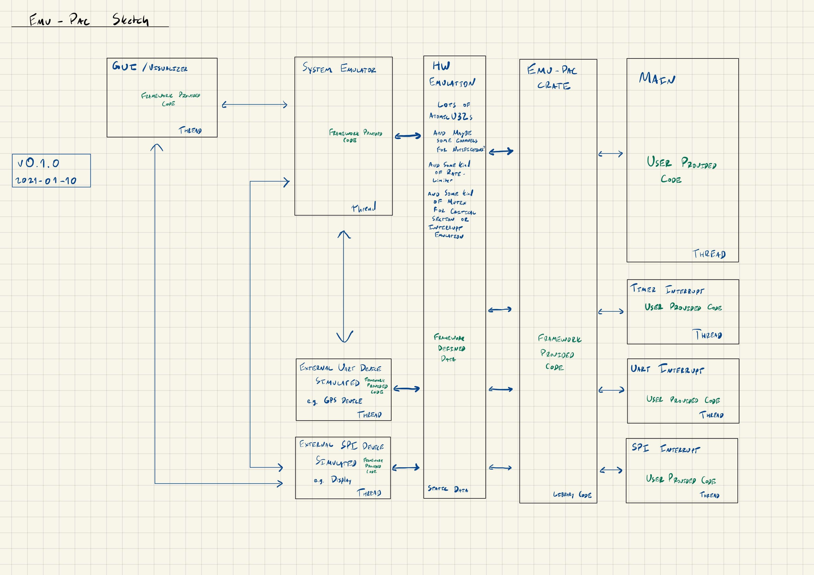

# emu-pac

Summary: The goal is to create an emulated "Peripheral Access Crate" for the purposes of learning and teaching embedded Rust. This would mean we would not require physical hardware to teach embedded Rust, and could also provide visualization and debugging tools that could help users diagnose issues they have.

Rather than using a more accurate tool for simulating an existing architecture, such as Arm or RISC-V, this would be a "native" target, capable of running on the host PC.

Ideally, this would allow people to create "fake" peripherals such as UART, SPI, and I2C, that could be exposed via simulated PAC interactions.

The idea would be to provide learning material, like the [Discovery Book](https://docs.rust-embedded.org/discovery/), based around this, so EVERYONE can learn a little embedded Rust (or at least the "higher in the stack" parts) without needing to buy specific hardware.

Once an `emu-hal` has been built on top of the `emu-pac`, the usual `embedded-hal` portability techniques could be used to integrate "off the shelf" drivers.

## Prior Art

This isn't a totally novel idea, RTOS' like RIOT-OS have a ["native" target](https://github.com/RIOT-OS/RIOT/wiki/Family:-native) that does something similar, though they simulate at the OS level. This is a similar technique, but moves the emulation layer down to the PAC, which I think could still be reasonable enough for Rust, where we still have the register interfaces to draw a boundary at, also sort of like [disasm](https://github.com/Disasm)'s [`avatar-rs`](https://github.com/Disasm/avatar-rs) does for passing CPU actions through to [probe-rs](https://probe.rs).

## Architecture Diagram

## Moving pieces

This is a brainstorm of the pieces needed to make this happen.

* Multiple threads for simulating each component
    * One "main" thread that acts as the entry point
    * One thread for each interrupt
    * One thread for "hardware simulation", running concurrently to the "main" thread
* An `AtomicU32` based primitive for each hardware register
    * This allows for multi-threaded sharing of "registers" between interrupts, "main", and the simulation context
    * We may want to have some sort of shared global mutex to simulate non-concurrency between interrupts, e.g. a critical section prevents all interrupts from touching any registers
    * We may want some kind of "rate limiting" of register access (read or write) to make the operational speed somewhat more reasonable, e.g. only allow one access per (1/64MHz) time scale, at least from the main/interrupt threads
* Simulators of external devices, such as a WS2812b
    * This will be necessary, as we won't have physical hardware
* We need to "invent" our own peripherals, e.g. define the register layout, capabilities, and behaviors of the provided UART, SPI, I2C, and Timer peripherals
    * We could also write an external connector, allowing for the simulated CPU to talk "real" SPI using a USB FT2232H (or similar) adapter
    * We probably want a "fake" RTT peripheral, which can be used for `rprintln` or `defmt` capabilities
* A "board simulator", which would be a 2d or 3d rendering of the board and any connected components, allowing users to "see" things like LEDs blinking, motors spinning, etc. based on the operation of the emulated CPU
* We probably need some kind of "notification system" where writes to certain registers can trigger behaviors, such as a peripheral starting operation

## Unknowns

There are a couple things I don't know how to handle, including:

* Use of `svd2rust`
    * Should we fake an svd2rust style interface?
    * Or should we make an actual SVD to stay coupled?
* How to build an `emu-rt` crate
* How to add `rtic` support
