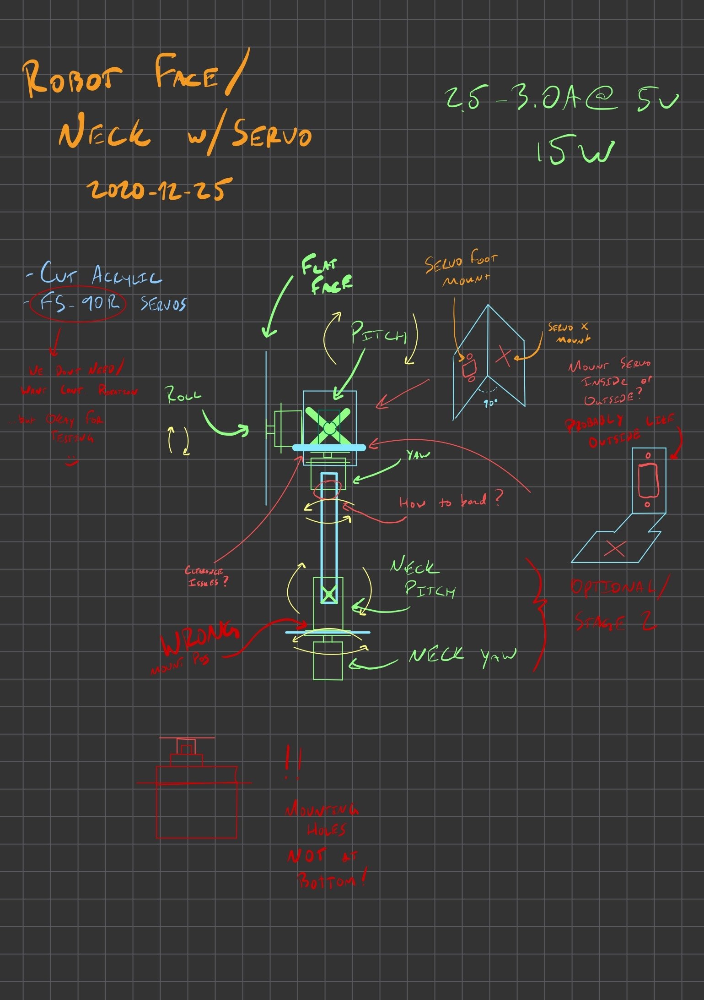

# Robot Face

Idea: Make a dev board that looks like a "robot face". Optionally put it on some kind of Servo arm to give it pitch/roll/yaw, and potentially a neck to rotate or tilt up/down.

## Original brainstorming

## Arm Logistics and Servo Control

