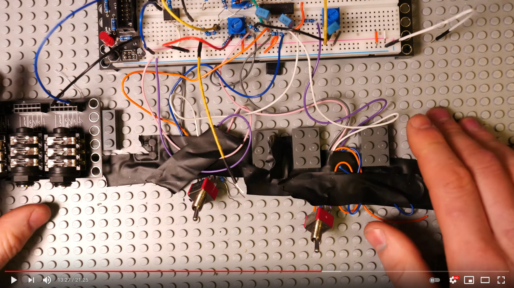

# Using Lego blocks as circuit rails

In [this youtube video](https://youtu.be/se68Wq4Gn6M?t=804), Look Mum No Computer has circuit boards that use Lego pegs as a mounting tool.

According to [this page](https://grabcad.com/tutorials/lego-01-basic-dimensions-bricks-explained), Lego bricks have an 8mm center-to-center spacing, with a 4.8mm outer diameter for the brick pegs. This means that the PCB hole would need to be just larger than 4.8mm, depending on the fab's tolerance.

It also seems that he [sells the modules](https://store.lookmumnocomputer.com/collections/kosmo-minis) used in the video on his store. I haven't been able to find any online design files though.
