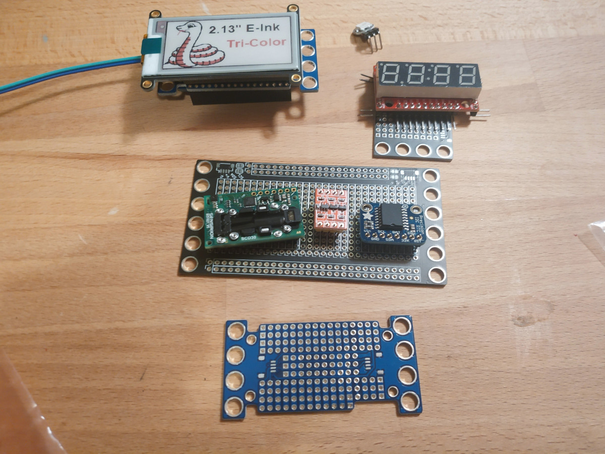

# Clock Parts

Two 6x12 boards

* Upper
    * Front
        * E-Ink
        * Piezo?
        * LEDs?
    * Back
        * Feather
        * Level Shifter
* Lower - All I2C
    * Front
        * 7-seg
        * piezo?
        * LEDs?
    * Back
        * SCD30
        * RTC

2x12 WS2812 mini?

* https://www.adafruit.com/product/4694
* https://www.adafruit.com/product/4142
    * "Refreshing the display takes about 25 seconds.""
