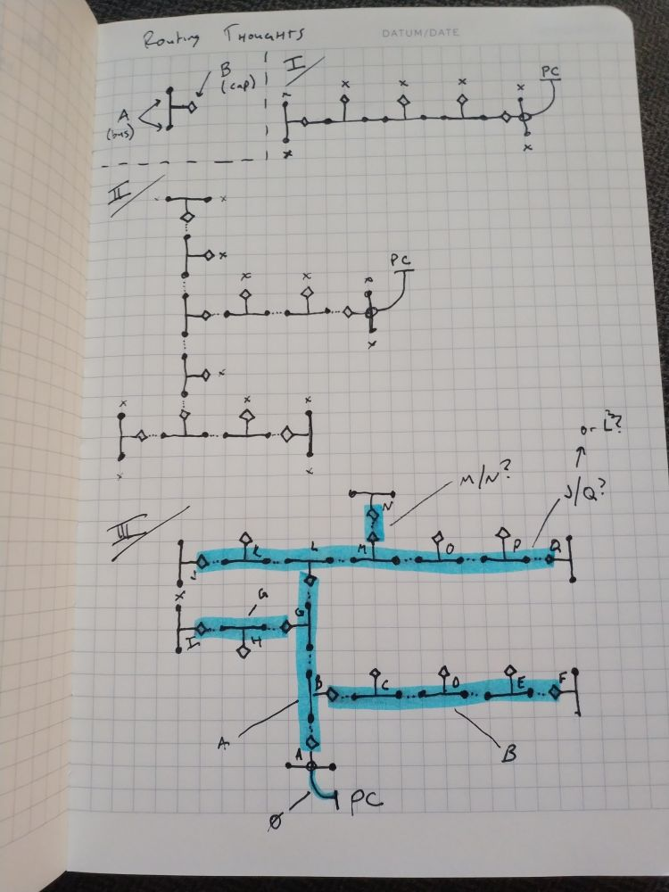

# Routing thoughts

## The algorithm

Quick reminder on terminology:

* We have nodes that have two "networks" they are connected to:
    * A single **cap** port on one network, where they are used to terminate either end of the bus
    * A pair of **bus** ports on the SAME network, which are used for daisy-chaining
* We have two roles a device can play on each "network" they exist on:
    * **dom**: Which means they coordinate/"command" the bus
    * **sub**: Which means they respond to commands from the **dom**

Previously: I thought that **dom**s would always operate on their **cap** port, but this isn't/doesn't always have to be true!

Since my goal is to make a DAG from the "PC" link (or some generic "uplink" connection), I might actually do my routing by basically having all the nodes being "asleep"/"silent" until spoken to, then they wake up and figure out what role they take.

Basically: if they get "woken up" on a network, they are a **sub** on that network.

After being "woken up", they then check their other network connection. If anyone responds, they become the **dom** of the other interface.

The PC uplink will be... a little different, in that the PC-attached device will be a dom of both busses, even though it was woken up by the PC. I guess this is still consistent, as it is basically a **sub** on the PC link, and a **dom** on all other networks.

## The example

So, I guess the sequence for `III` (in the diagram above) would be:

1. A is woken up by the PC link
2. It checks its Cap port. It gets some kind of response on the bus
3. It checks its Bus port. It gets no response. That port now becomes idle (maybe checking again later)
4. A begins enumerating devices on the bus. At some point, it now knows about B, G, and L.
5. Once B, G, and L are awake, they each check their OTHER port. They each find:
6. B enumerates C, D, E, and F - so B is a sub on it's bus, and a dom on its cap. C, D, E, and F are all only subs (because they find no devices on their other ports
7. G enumerates H and I - so G is a sub on its bus, and a dom on its cap. H and I are only subs (same as above)
8. L enumerates J, K, M, O, P, and Q - so it is a sub on the cap, and a dom on the bus
9. J, K, M, O, P, and Q go through the same dance
10. J, K, O, P, and Q are subs-only
11. M enumerates N, so M is a sub on the bus, and a dom on the cap
12. N checks, finds nothing, sub only, process complete

Since the PC could potentially "see" (or be notified) of all of these changes, I guess the PC itself could determine the DAG, or the shortest path, even in the case of a loop, and just command-back the routing path necessary to return to the PC.

I don't really need or want the bus to be totally self standing (famous last words)
