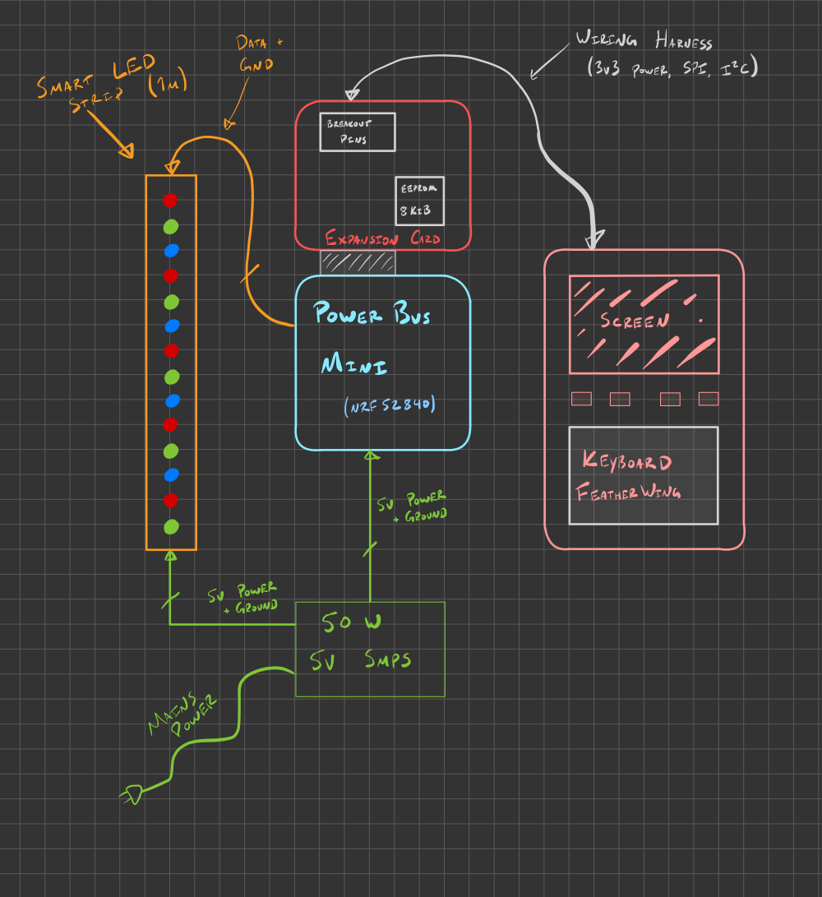

# One day build: Self-Care Meter

## Overview

Okay, I want some kind of meter that reminds/motivates me to take care of little self care tasks.

This could be basics that sometimes get procrastinated on, like doing the dishes, eating a healthy meal, or going for a walk; to mental health tasks, like reading a book, or taking time to meditate or sit and think; to more aspirational goals, like exercise or completing side projects.

## Implementation details

I think there will be a couple major parts in play here:

* A 50W 5V switch mode power supply
    * Provides power for all electronics including LEDs
* A [Powerbus mini] as the "brains" of the operation, based on the Nordic nRF52840
* A [Powerbus mini] expansion card, which has pins broken out, as well as an 8KiB EEPROM for storing data
* A [Solder Party] [Keyboard FeatherWing] as the main User Interface
    * This has an Adafruit Feather connector on the back.
    * I'll use a [FeatherWing Proto] as an adapter between the wiring harness and the FeatherWing.
* A Smart LED strip in a diffused, 1 meter housing, with 60-144 LEDs
* A pair of wiring harnesses to connect the [Keyboard FeatherWing] and Smart LED strip to the [Powerbus mini]

[Powerbus mini]: https://jamesmunns.com/blog/nwsltr-2021-12-15/
[Solder Party]: https://www.solder.party/
[Keyboard FeatherWing]: https://www.solder.party/docs/keyboard-featherwing/rev1/
[FeatherWing Proto]: https://www.adafruit.com/product/2884

## Build log

I came up with this idea a few days before January 7th, and I plan to make as much progress as possible during this weekend.

If you're reading this on the 7th, stay tuned! I'll push updates here as I go.
