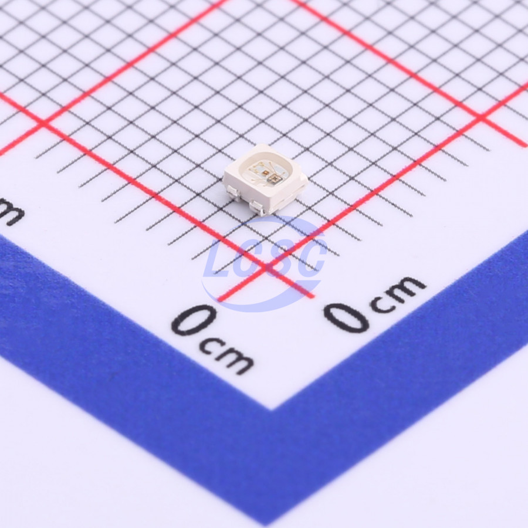

# Smart LEDs

TODO: Link the following datasheets:

* WS2812b
* SK6812w
* APA102

TODO: Explain smart leds and their protocol

TODO: Explain techniques for using SPI, I2S, PWM, etc. for controlling smart leds

## TCWIN TC2020RGB

* [PDF Datasheet](./TCWIN-TC2020RGB_C784564.pdf)
* [LCSC Page](https://lcsc.com/product-detail/Light-Emitting-Diodes-LED_TCWIN-TC2020RGB-3CJH-TX1812Z5_C784564.html)
* 0.05 - 0.07 EUR per LED

I found this small (2.1mm x 2.1mm) LED that seems to use the same Smart LED protocol as the WS2812/SK6812/AP102 families. At the time, it was available in a small-ish quantity (600 stock or so) on JLCPCB parts list, which was enough for 5 of the original [Calculator Keypad](./../../projects/calculator.md) prototypes.

I haven't yet tested them to see if they require different control schemes or modifications from standard techniques.
