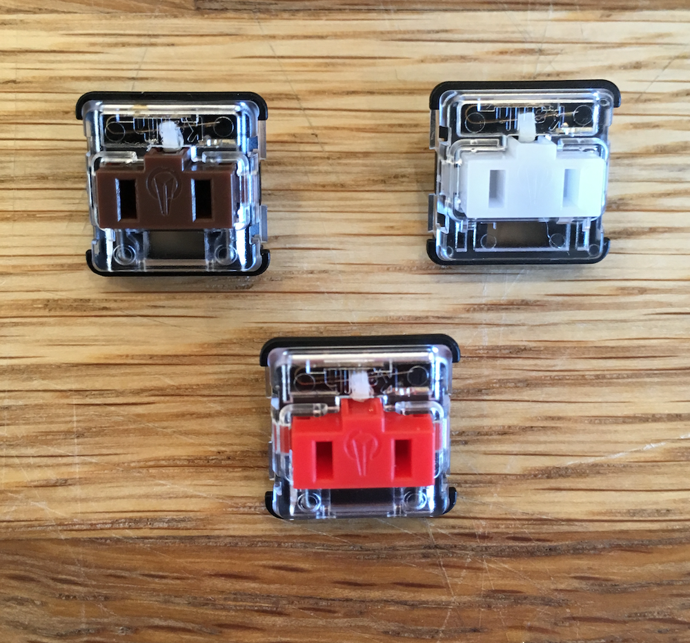

# Kailh Choc Low Profile 1350s

* [PDF Datasheet](./CPG135001D02-1_Choc_Burnt_Orange.pdf)
* [kbdfans product page](https://kbdfans.com/products/kailh-low-profile-1350-choc-rgb-switch-10-pcs)
* [switchtop product page](https://www.switchtop.com/product/kailh-low-profile-1350-chocolate-switches)

These low profile switches have a size of 15mm x 15mm x 8mm. These are the same switches used on the [MNT Reform](https://mntre.com/media/reform_md/2020-05-08-the-much-more-personal-computer.html). I also use this for my [Calculator project](./../../projects/calculator.md).

The switches have a 5.00mm x 3.15mm window for LEDs.

The MNT Reform uses the following center-to-center spacing for the keys:

* X spacing of keys: 18.60mm
* Y spacing of keys: 17.60mm

This spacing seems to give an approximately 1.1mm gap between the keycaps of each key.

They are not compatible with Cherry-MX switches. The MNT Reform has a [variety of footprints and symbols](https://source.mntmn.com/MNT/reform/src/branch/master/reform2-keyboard-pcb) available for use.

These switches seem to come in three varieties:

* Red - "Linear"
* Brown - "Tactile"
* White - "Clicky"

I haven't been able to find a good source of bulk switches, with the product pages above offering them in 10 packs or 20 packs, with limited stock, and expensive from-the-US shipping.

## Keycaps

I haven't been able to find an official source of Keycaps, or a good bulk source.

I have ordered these two different "artisan" sets of 1u caps (expensive, especially with shipping from the US):

* [Ergo Alphas - Black](https://mkultra.click/collections/keycaps/products/mbk-choc-keycaps?variant=31262644961378)
* [Natural Choc Keycaps](https://mkultra.click/collections/keycaps/products/natural-choc-keycaps-1u?variant=31918524465250)

The Ergo Alphas state they have a size of 17.5mm x 16.5mm, while the Natural keys don't list a size.

In this [blog post](https://mntre.com/media/reform_md/2020-01-18-finishing-reform.html), Lukas from MNT Research states "Blank keycaps are sourced from Kailh", though I don't know how he ordered them (probably in bulk), maybe I could buy a batch of keycaps and keys from him.
