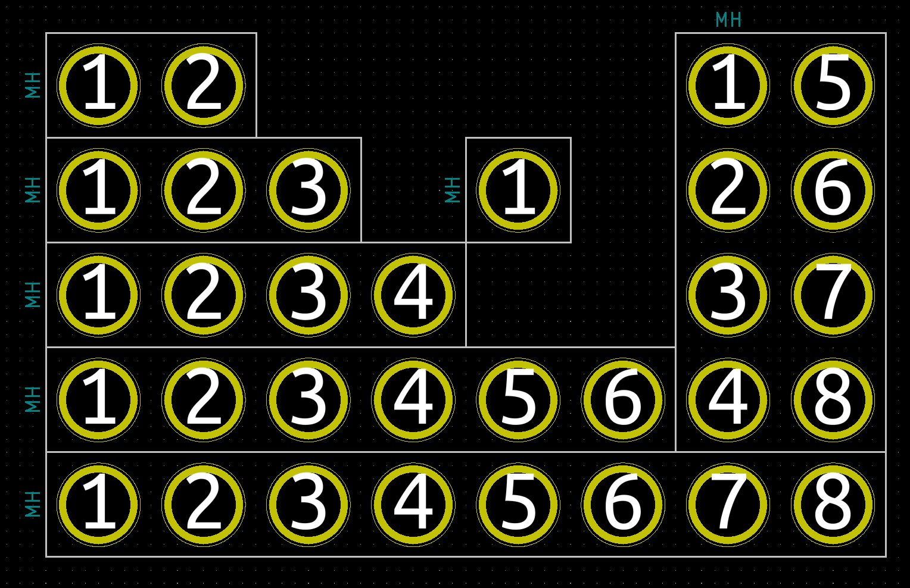
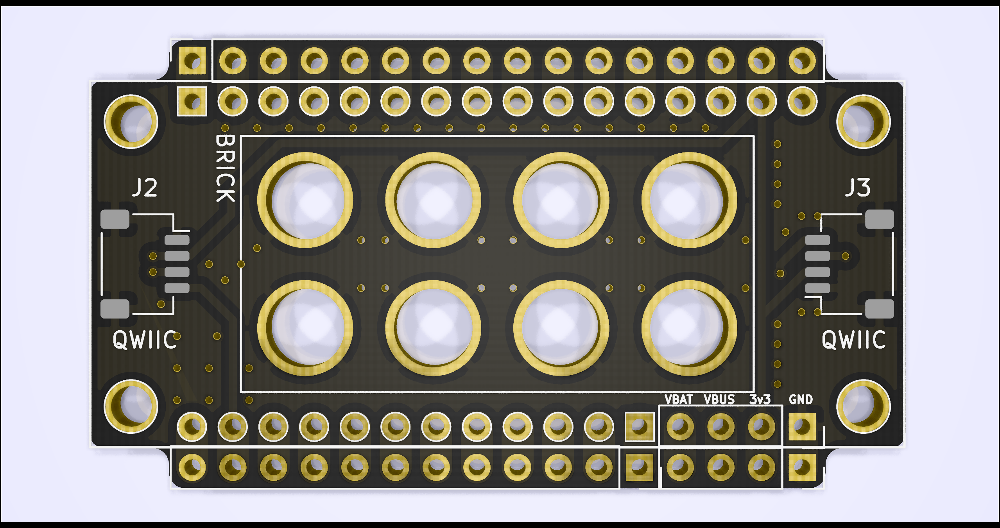
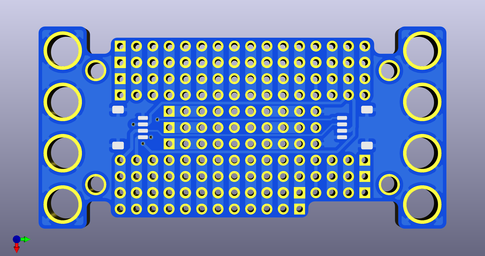
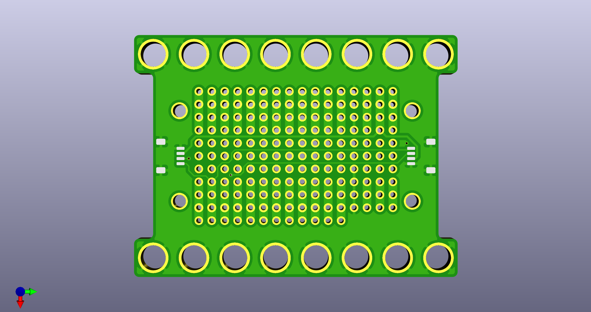
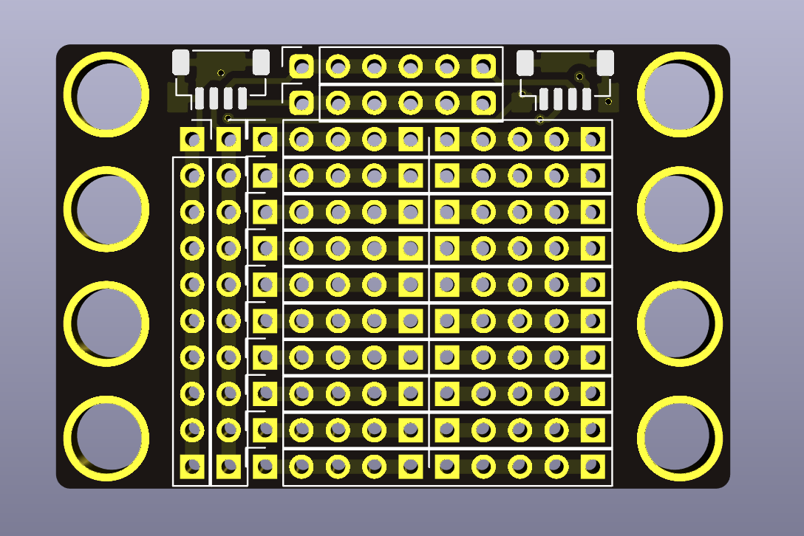
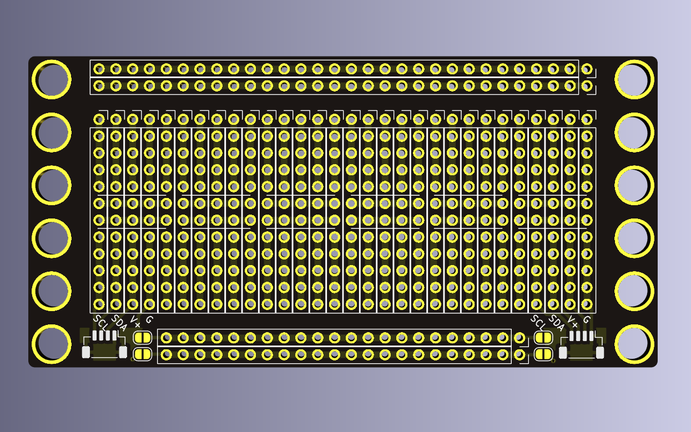

# Brick Mount

"Brick Mount" is a project to use LEGO bricks (or other similar building blocks) as a fundamental basis for laying out circuit boards and modules while prototyping.

This is achieved by designing boards that have holes compatible with the "pegs" of a LEGO brick, e.g. 4.8mm pegs with a spacing of 8.0mm. With cheap board design services like OSHPark or JLCPCB, it is relatively straightforward to design these holes onto breakout boards or other assemblies.

This allows for arrangement of components into pretty much any 3d structure, and even prototyping (or shipping!) enclosures using LEGOs directly.

This idea is not original (and has likely been done many times before), but I was inspired by [LOOKMUMNOCOMPUTER](https://www.lookmumnocomputer.com/)'s [Kosmo Minis](https://store.lookmumnocomputer.com/collections/kosmo-minis) parts, which use exactly this scheme.

I have collected KiCAD footprints as well as the boards I have designed so far in [this GitHub repo](https://github.com/jamesmunns/brick-mount). At the moment, I have not yet been able to verify the footprints or boards (I'm waiting for boards to be delivered).

## Background

When working on projects consisting of multiple boards, it is useful to group them onto a single physical medium, so they don't turn into a web of connectors, to relieve cable strain when moving or storing them, and to make it easy for them to "travel together".

It could be possible to use a breadboard (or three) for this purpose, but I haven't gotten into the habit of having a stack of breadboards around, and they always seem finnicky to me. Perma-proto boards are also an option, but then I still need to mount them to something, and it can be difficult to rework.

Over the past months, I've used a variety of methods, including cardboard or foam core board as a backboard, with spacers to mount the PCBs. This is always a little tedious, and I didn't love it. It also meant having the right set of spacers around, and I really should have ordered some kind of punch tool for M3 or similar screws.

For lighter boards, I've even duct-taped PCBs to cardboard, usually by their cables. This works, but was inelegant.

## Current Footprint Design

Currently, I have seven footprints that I have designed:

* 1x1 peg
* 1x2 pegs
* 1x3 pegs
* 1x4 pegs
* 1x6 pegs
* 1x8 pegs
* 2x4 pegs

Each part has the following features:

* A courtyard that wraps around each peg.
    * A 1x1 peg would have an 8x8mm courtyard
    * A 1x2 peg would have an 8x16mm courtyard
* A hole with a drill diameter of 4.9mm, to allow some clearance of the peg diameter of 4.8mm.
    * This +0.1mm tolerance is influenced by the [capabilities of my usual PCB fabricator](https://jlcpcb.com/capabilities/)
    * I don't know yet if these will be tight enough tolerance to "snap" to the pegs of the brick, or if they will require glue or a cap.
* An annular ring with a diameter of 6.0mm
    * These could be electrically connected, or used with some kind of connection wire or alligator clip.
    * So far, I've left these unconnected or grounded in all of my designs

These features were based on [this page](https://grabcad.com/tutorials/lego-01-basic-dimensions-bricks-explained)'s CAD analysis of LEGO bricks.

That's pretty much it. In my boards, I've left 0.25-0.50mm edge-cut clearance (inside the courtyard) to ensure that my boards will fit "inside" of the footprint of an actual lego brick.

## Current Board Designs

I've designed a couple of boards to test out working with this concept. These boards have been designed and ordered (the KiCAD projects are [in the repo](https://github.com/jamesmunns/brick-mount)), though I have not received or tested them yet.

### Feather Carrier - Small

This board is meant to mount to a single 2x4 brick. Because it mounts internally, it is probably best suited for boards that don't require a lot of movement, or for boards with a lot of top mounted buttons.

This carrier can be used for mounting an [Adafruit Feather](https://www.adafruit.com/feather) compatible board, or Featherwing expansion board.

It features:

* Two horizontal QWIIC connector footprints (daisy-chainable)
* A single set of breakout headers for each feather pin
* Two additional breakout pins for each of GND, VBUS, VBAT, and +3v3 power rails
* Feather mounting holes

### Feather Carrier - Medium

This board is top and bottom mounted. It features additional cutouts for running wires within the 4x8 peg footprint, and has additional prototyping space.

This carrier can be used for mounting an [Adafruit Feather](https://www.adafruit.com/feather) compatible board, or Featherwing expansion board.

It features:

* Two horizontal QWIIC connector footprints (daisy-chainable)
* Three breakout pins for each feather pin
* Three additional breakout pins for each of GND, VBUS, VBAT, and +3v3 power rails
* A mix of vertical bus connections and connectionless prototyping pins
* Feather mounting holes

### Feather Carrier - Large

This board is side mounted. It features additional cutouts for running wires within the 6x8 peg footprint, and has additional prototyping space.

This carrier can be used for mounting an [Adafruit Feather](https://www.adafruit.com/feather) compatible board, or Featherwing expansion board.

It features:

* Two horizontal QWIIC connector footprints (daisy-chainable)
* Three breakout pins for each feather pin
* Three additional breakout pins for each of GND, VBUS, VBAT, and +3v3 power rails
* A mix of vertical bus connections and connectionless prototyping pins
* Feather mounting holes

### Proto Board - Quarter

This board is a general purpose prototyping board, inspired by the Adafruit [Perma Proto](https://www.adafruit.com/product/589) board.

It features:

* Two vertical QWIIC connector footprints (daisy-chainable)
* A row of 6 pins for each of SDA and SCL that are common with both QWIIC connectors
* A column of 10 pins for each of GND and +3v3 that are common with both QWIIC connectors
* 20 5-pin rows, arranged as a 10x10 pin prototyping space
* Fits a 4x6 peg footprint

> NOTE: In the future, I will likely revise the boards to use the same horizontal QWIIC connector as the feather boards. This will likely reduce the number of power rail pins by one for each rail, and the top prototyping row to three pins instead of five to allow for connector room. It will also swap the rows used for SDA and SCL breakout.

### Proto Board - Half

This board is a general purpose prototyping board, inspired by the Adafruit [Perma Proto](https://www.adafruit.com/product/1609) board.

It features:

* Two vertical QWIIC connector footprints
    * These require a connection on the board to daisy-chain
* Two 30-pin power rails
* Two 24-pin power rails, that can be connected to the QWIIC connectors via Solder Bridges
* A row of pins for each of SDA, SCL, +3v3, and GND, for each of the two QWIIC connectors
* 60 5-pin rows, and 12 5-pin center columns arranged as a 30x12 pin prototyping space.
* Fits a 12x6 peg footprint

> NOTE: In the future, I will likely revise the boards to use the same horizontal QWIIC connector as the feather boards. This will not affect the number of prototyping pins, though will change the ordering of the breakout rows. I may also provide some way to short the SDA and SCL pins without running a discrete wire, e.g. using another pair of solder jumpers.
