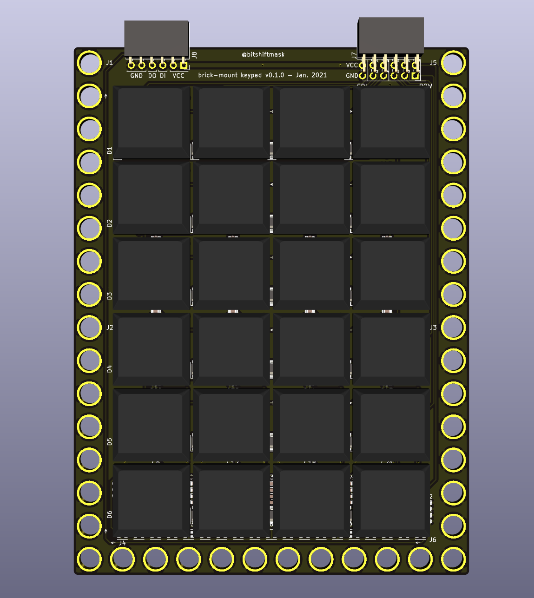

# Calculator

I realized that I will reach for my phone or for a `python` REPL window for most basic math operations.

Additionally, there are a couple things that I could probably stand to offload from my phone, in order to look at it less often. This includes:

* Calculator
* Unit Conversion
* Alarm Clock
* Timer
* Counting mode
* Time tracking (a la Vintage)
* todo list/checklist

I figured I'd try my hand at making a replacement for my old-school TI-83, and maybe make a REPL with CircuitPython or even a Rust based scripting language like RHAI.

## The Keypad

### Behavior

See [Notes from 2021-01-22](./../notes/2021/2021-01-22.md) for the original KeyPad investigation and brainstorming.

So, I have a limited number of keys to use, so I started looking at what kind of keys I typically used in my Python REPL. It turns out, they were surprisingly low.

* Numbers
* Parenthesis
* Operators
* Period
* Equals
* Letters (for variables - T9?)
* Comment (#)
* Arrows
* Enter

I came up with a 4x6 arrangement that I thought would be pretty reasonable (for a calculator):

```
+   -   *   /
7   8   9   (
4   5   6   )
1   2   3   #
=   0   .   FUNC
LET ARR SPC ENT
```

For the "Special" keys:

* "FUNC": Some kind of menu for python keywords (`for`, `min`, `max`, `sin`, `cos`)
* "LET": Switch the keypad into T9 mode for entering letters
* "ARR": Switch the keypad into arrow mode for navigation
* "SPC": Space Bar
* "ENT": Enter/Return

### Hardware



Inspired by the [MNT Reform](https://mntre.com/media/reform_md/2020-05-08-the-much-more-personal-computer.html), I wanted to use low profile mechanical keys. Luckily, the MNT Reform hardware is [all open source](https://source.mntmn.com/MNT/reform), which means I could see the footprints, circuit, and spacing used.

I put together a 4x6 keyboard matrix PCB, with LEDs under each key, and a row of 19 LEDs at the bottom, maybe to use for palm lighting or notifications.

It has one connector for the Row/Column IO, and one connector for the WS2812-alike smart LEDs.

[The hardware project is here](https://github.com/jamesmunns/brick-mount/tree/main/boards/choc-keypad).

I plan to use:

* [Kailh 1350 Low Profile Switches](https://kbdfans.com/products/kailh-low-profile-1350-choc-rgb-switch-10-pcs?variant=34418543034507)
    * I ordered a mix of Brown "Tactile" and White "Clicky" keys
* One or a mix of these keycaps:
    * [Ergo Alphas - Black](https://mkultra.click/collections/keycaps/products/mbk-choc-keycaps?variant=31262644961378)
    * [Natural Choc Keycaps](https://mkultra.click/collections/keycaps/products/natural-choc-keycaps-1u?variant=31918524465250)
* [TCWIN 2020 Smart LEDs](https://lcsc.com/product-detail/Light-Emitting-Diodes-LED_TCWIN-TC2020RGB-3CJH-TX1812Z5_C784564.html)
    * These are used for the Key lighting as well as the bar at the bottom
    * They seem to take 5mA each, for a total of 215mA for the whole board (43 LEDs/board)

See my parts pages for more details about the [switches and keycaps](./../parts/switches/kailh-1350.md), and for the [smart leds](./../parts/leds/smart-leds.md).

I might use black keycaps for the numbers, and clear keycaps for the "meta" keys. TBD.

So far, I haven't chosen an MCU, but I'll use a feather board or something, and likely prototype the UI and behavior from my PC before digging into the embedded side of things.

## The Screen

I want to have some kind of screen that fits above the keypad. I've thought about keeping the total size of the calculator device roughly to the size and shape of my current cellphone, which is 150.0mm x 75.0mm.

Right now, the Keyboard (minus LEGO mounting rails) takes up about 112.0mm x 80mm.

Ideally, I'd find some sort of 4:3 ratio LCD or epaper display that has dimensions of rougly 60.0mm x 80.0mm. This would give a total device size of 172.0mm x 80mm, which is close enough to the target.

For a low volume 4:3 screen, the [Adafruit TFT FeatherWing 3.5"](https://www.adafruit.com/product/3651) seems to be close to perfect, at 65.0mm x 85mm. It has a 480x320px screen, which should allow for a reasonable amount of visibility. It also has a resistive touchscreen, which would be a good secondary input interface.

With a 16:9 ratio, I would have a display of 45.0mm x 80.0mm, which would give a total size of 157.0mm x 80mm, which would be almost exactly the size of my phone.

I've also thought about mixing LCD and e-paper, think like an Accountant's calculator with the paper feed, but with e-paper instead of the paper reel (a single row of LCD/LED characters for quick updates, e-paper for history).

I could also consider using one of the Sharp transflective displays, though having some way of backlighting would probably be desirable. Joey Castillo uses these for his [PyCorder](https://blog.oshpark.com/2021/01/19/meet-the-pycorder/), which I think is the [2.7" Sharp Memory LCD LS027B7DH01A](https://www.digikey.com/short/4tr05m) which is $27 in singles. This display has an outline of 62.8mm x 42.82mm, and a 400x240px resolution.

They also seem to offer a [4.4" Sharp Memory LCD LS044Q7DH01](https://www.sharpsde.com/products/displays/model/LS044Q7DH01/), though this is a bit lower resolution (320x240) strangely, and a bit big for my ideal (94.8mm x 75.2mm).

Outside of Memory LCDs, Sharp also seems to have a 3.7" RGB option with the [LS037V7DW06](https://www.digikey.com/short/4tr0r8) and [LS037V7DW05](https://www.digikey.com/short/4tr0rn), though these are considerably more expensive at $70 or so, and are not currently in stock or available as singles, at least through Digikey. These also seem to require a parallel RGB interface, and higher current requirements.

## Batteries

I think a single LiPo pouch cell is probably the best idea here. The battery width could be 70.0mm to 80mm pretty comfortably, as well as 110.0mm to 150.0mm, depending on the size of the display.

For reference, Adafruit's [largest pouch cell](https://www.adafruit.com/product/328) is 2500mAh, at 62.5mm x 50.5mm x 8.1mm.

## Scripting

I'll probably want some kind of scripting language with support for UI/HW control. I think my best options at the moment are:

* [Neotronian](https://github.com/Neotron-Compute/Neotronian) - from the Monotron/Neotron family, designed for constrained environments
* [Rhai](https://github.com/rhaiscript/rhai/) - a configurable DSL/embedded scripting language

## Next Steps

Now I need to wait for the keypad to arrive, and likely make a pretty "dumb" USB peripheral out of it. Then I can start working on a plan for the UI, likely simulated on-PC, until I find a design I like.
