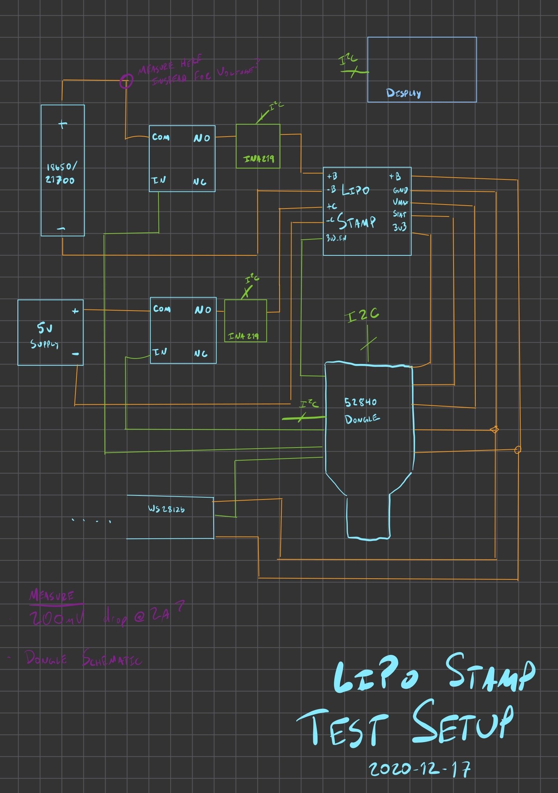

# LiPo Stamp

The LiPo Stamp is a small sized, general purpose LiPo charge controller with power path and a 3v3 regulator. Currently the targeted size is 0.7" by 0.7", or just under 18mm square. It is intended to be used with single cell 18650, 21700, pack, or similar batteries.

I intend to use this in projects such as [Kuma's Collar](./kuma-collar.md).

## Features

* TP4056 Charge Controller
    * 500mA charging current
    * Low voltage trickle charging
* Over/Under-voltage Protection
    * AP9101CK6 + FS8205
    * Disables battery on over/under charge
* Power Path
    * Provides power via USB when connected
    * 500mA max output (USB or Battery)
* Switchable 3v3 Regulator
    * Default off
    * 100mA+ output
* Resettable Polyfuse
    * For high current, direct battery applications (e.g. LEDs)
    * Max 2A continuous output

The main project page for the LiPo Stamp is [hosted on GitHub](https://github.com/jamesmunns/lipo-stamp).

## Testing

I plan to build a hardware in the loop test rig for the LiPo stamp. It will probably be a proto-version of the [KTA], though probably not strictly at the start.

[KTA]: ./kta.md

### Unsorted test brainstorming

I think I will need the following equipment/setup items for the test cases.

* A LiPo Stamp
    * Mounted to a breakout board for easy wiring
    * Maybe with headers or screw terminals
* A [KTA]
    * This will "Run" the test
    * Also use some ADCs to measure voltage
    * Also look control GPIO input/outputs for LiPo stamp
* A 5v supply
    * This only needs to provide 500mA for charging, so USB might be suitable if it can power everything
    * Otherwise use an external AC/DC supply
* [INA219 breakouts]
    * Measure battery input/output
    * Measure 5v charging line
* Relays to connect/disconnect:
    * 5v charging source
    * Battery connection (high side)
    * LED connection (high side)
* WS2812B strip/panel for programmable load
* Some kind of display for monitoring output?
* Protected 18650 cell
    * Probably NCR-18650B, rated to 5A discharge, 2.5v cutout
    * 3.6v nominal
    * [PDF Datasheet](https://www.imrbatteries.com/content/panasonic_ncr18650b-2.pdf)
* Unprotected 18650/21700 cell
* I might need some kind of custom holder for protected battery cells (if they don't fit the holders I have)

I think I will need at least the following test cases for the board:

1. No battery, 5v present
    1. Check vmax output
    2. Check 3v3 output (disabled)
    3. Check 3v3 output (enabled)
2. Protected cell
    1. 5v connected
        1. Check vmax output
        2. Check 3v3 output (disabled)
        3. Check 3v3 output (enabled)
        4. Verify charging
        5. Wait for charge complete
        6. Verify charging complete (no charging)
        7. Verify LEDs (manual)
    2. 5v disconnected
        1. Check vmax output
        2. Check 3v3 output (disabled)
        3. Check 3v3 output (enabled)
        4. Begin discharge pattern
        5. Verify cutout at low voltage
        6. Verify LEDs (manual)
3. Polyfuse test
    1. Charge all the way
    2. Discharge at steps
        * 500mA
        * 1000mA
        * 1500mA
        * 1900mA
    3. Verify discharge okay, no cutout
    4. Push discharge above levels
        * 2000mA
        * 2100mA
    5. Ensure cutout occurs after XX seconds
    6. Disconnect load
    7. Ensure board restores after YY seconds
4. Unprotected Cell
    * Probably repeat steps above to verify cutout happens because of LiPo Stamp protections, not protected battery
    * How to generate load at voltages below the cut-out voltage? We probably need to go as low as 2.5v to verify cut-out.

[INA219 breakouts]: ./../parts/sensors/ina219.md
