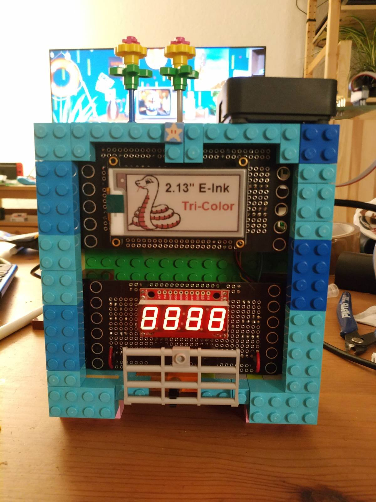

# Sensor Clock

The sensor clock is intended to be a general purpose clock/alarm clock, as well as a host to a number of environmental sensors, including CO2, Temperature, and Humidity sensors.

## Parts

* [Adafruit nRF52840 Express](https://www.adafruit.com/product/4062)
* [Adafruit 2.13 Tri-Color eInk Display](https://www.adafruit.com/product/4128)
* [Adafruit DS3231 RTC](https://www.adafruit.com/product/3013)
* [Sparkfun 7-Segment Serial Display](https://www.sparkfun.com/products/11441)
* [Sensirion SCD30](https://www.sensirion.com/scd30/)
* 2x Piezo Buzzers
* A few [brick-mount](./brick-mount.md) boards
* Some LEGOs for a case

The parts communicate over I2C. The top and bottom boards are connected via QWIIC connectors.

## Displays

The Seven Segment display rotates between:

* Time
* CO2 measurement
* Temperature measurement
* Humidity measurement
* Uptime measurement

The ePaper display will be used to show a graph of the last 3- or 48-hours of CO2 levels.

## Future Plans

* Add notification LEDs
* Add Wireless for sensor readings
* Implement buzzers
