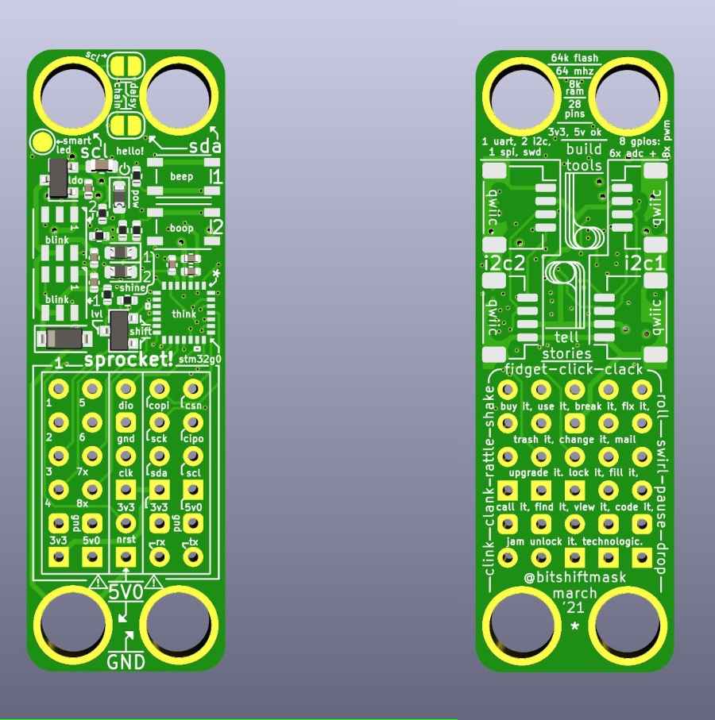
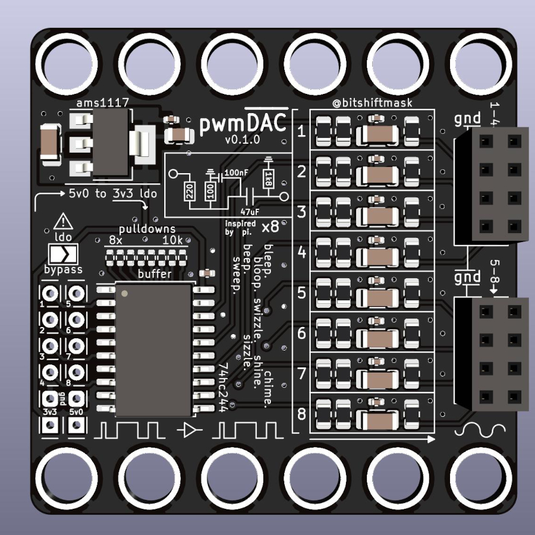

# Sprocket Boards

This is a breakout board for the STM32G031. Each board is 15.0x47.0mm.

Each board costs under 2.00 EUR/ea at 100 units.

I documented the design process here:

<blockquote class="twitter-tweet">
A design process story in 4 pictures, from concept to board. I&#39;m still waiting on the boards to arrive (looks like they&#39;ll be done being built tomorrow hopefully), but I thought I would wax nostalgic about how my process worked for this.  Read along for more details. 1/? <a href="https://t.co/6kHYOADmBB">pic.twitter.com/6kHYOADmBB</a>
&mdash; James Munns (@bitshiftmask) <a href="https://twitter.com/bitshiftmask/status/1371607069611200514?ref_src=twsrc%5Etfw">March 15, 2021</a></blockquote> 

And streamed most of the original design on YouTube here:

<iframe width="560" height="315" src="https://www.youtube.com/embed/K3h69aeZh9U?start=405" title="YouTube video player" frameborder="0" allow="accelerometer; autoplay; clipboard-write; encrypted-media; gyroscope; picture-in-picture" allowfullscreen></iframe>

## The Board

It has:

* A 28-pin STM32G031
    * 64MHz Cortex M0+
    * 8KiB RAM
    * 64KiB Flash
* Two WS2812b-style Smartleds
* Two User buttons
* Reverse Protection Diode
* One Power LED (always on)
* Two User LEDs
* 3.3v LDO
* Four QWIIC connectors
* Three main connectors:
    * One with 8 GPIOs, all with PWM, six with ADC channels and Power
    * One with I2C, SPI, UART, and Power
    * One with SWD connectors, reset pin, and power

The board is meant to be [brick mount](./brick-mount.md) compatible, and is the same size as a LEGO 2x6 Plate.

The four mounting pins each electrically connect to:

* +5V0
* Ground
* SDA (3v3)
* SCL (3v3)

These connectors are intended for use with a testing, programming, or configuration jig.

## Compatible Add-On Boards

I don't know if I'll make a lot of accessories, but I'll certainly make some.

### Clink board

This board is intended to take PWM as inputs (on up to eight channels). The PWM signal is buffered by a TI 74HC244D, and sent through an RC circuit, taken from the [Raspberry Pi 3B+ Audio](https://hackaday.com/2018/07/13/behind-the-pin-how-the-raspberry-pi-gets-its-audio/).

I don't expect Hi-Fi audio, but might be useful to make appropriate bleep-bloops.

The board also contains it's own 5V LDO to reduce signal noise.
